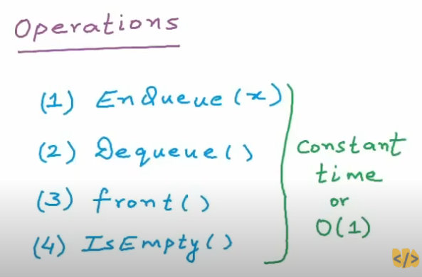
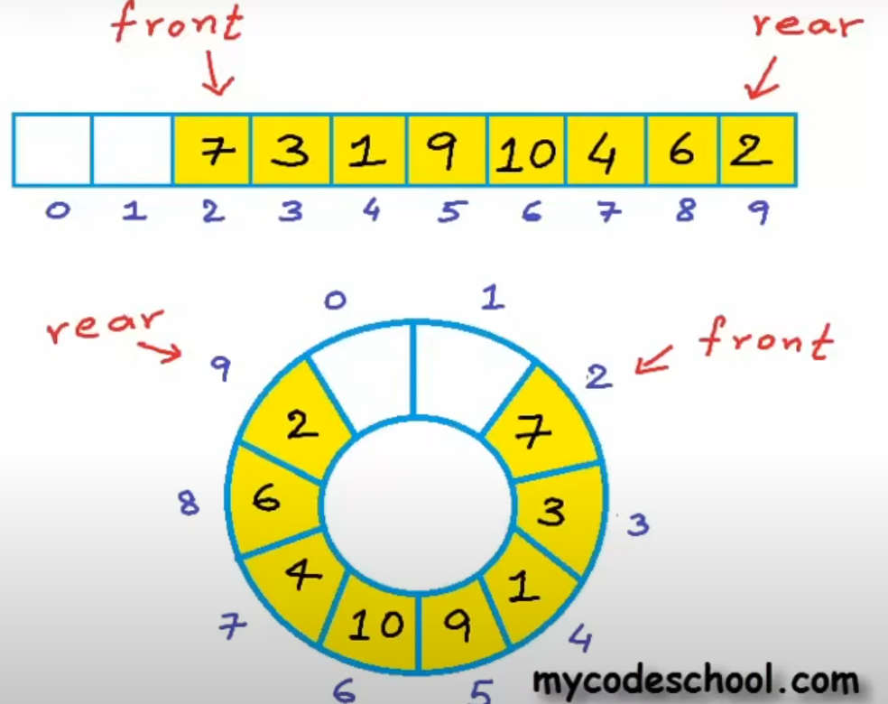
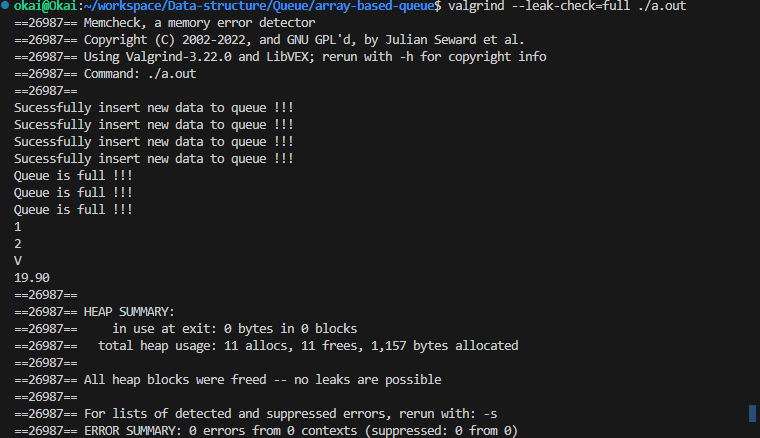

### QUEUE

## Operation

## Circualr-array based implementation vs Array based implementation

## How to run the example
    gcc -o queue circular_array_based.c

## Memory leak testing with Valgrind tool
    valgrind --leak-check=full ./queue.out

